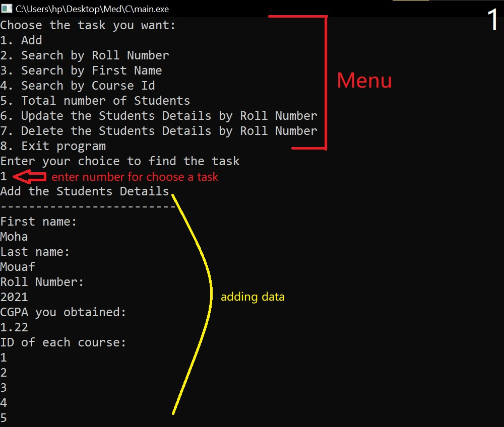

# Student Information Management System (C)

## Problem Statement:
Write a program to build a simple Software for Student Information Management System which can perform the 
following operations: 
   1. Store the First name of the student.
   2. Store the Last name of the student.
   3. Store the unique Roll number for every student.
   4. Store the CGPA of every student. [online Calculator](https://gpacalculatorbd.com/cgpa-calculator)
   5. Store the courses registered by the student.

## Steps:

### Add Student Details: 
   Get data from user and add a student to the list of students. While adding the students into the list, check for the uniqueness of the roll number.
   
   

### Find the student by the given roll number: 
   This function is to find the student record for the given roll number and print the details.
   
   

### Find the student by the given first name: 
   This function is to find all the students with the given first name and print their details.

### Find the students registered in a course: 
   This function is to find all the students who have registered for a given course.

### Count of Students: 
   This function is to print the total number of students in the system.

### Delete a student: 
   This function is to delete the student record for the given roll number.

### Update Student: 
   This function is to update the student records. This function does not ask for new details for all fields, but the user should be able to pick and choose what he wants to update.

### Exit Program: 
